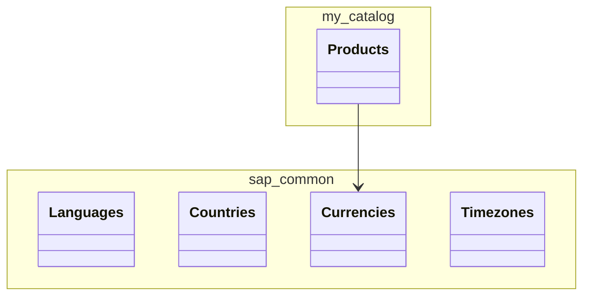

<!-- generated by scripts/gen-registry.mjs | sources: 968e9aebc343eb2e | 2026-09-06 | do not edit -->
# Доменная модель

Эффективная модель после компиляции: сущности, элементы, типы и аспекты проекта. Источник истины это `db/*.cds` и `srv/annotations/*.cds`; здесь только их отражение. Для точечного поиска используй `mcp__cds-mcp__search_model`.

## Диаграмма

## Сущности

### my.catalog.Products

Аспекты: cuid, managed. Ключи: ID. Проекции: CatalogService.Products.

| Элемент | Тип | Название (en) | Аннотации |
| --- | --- | --- | --- |
| ID | UUID(36) |  | key |
| createdAt | Timestamp | Created On | @readonly, computed |
| createdBy | String(255) | Created By | @readonly, computed |
| modifiedAt | Timestamp | Changed On | @readonly, computed |
| modifiedBy | String(255) | Changed By | @readonly, computed |
| name | String(100) | Product Name | @mandatory |
| description | String(500) | Description |  |
| price | Decimal(10, 2) | Price | @mandatory, @Measures.ISOCurrency: currency_code, @assert.range: [0,99999999.99] |
| currency | Association to sap.common.Currencies | Currency | @mandatory |
| currency_code | String(3) | Currency | @mandatory |
| stock | Integer | Stock Quantity | @mandatory, @assert.range: [0,1000000] |
| category | String(50) | Category | @mandatory |
| imageUrl | String(500) | Image URL |  |

## Типы и аспекты проекта

| Имя | Вид | Определение |
| --- | --- | --- |
| User | type | String(255) |
| Currency | type | Association to sap.common.Currencies |
| cuid | aspect | ID |
| managed | aspect | createdAt, createdBy, modifiedAt, modifiedBy |

## Переиспользуемые аспекты из @sap/cds/common

`cuid` (key ID : UUID), `managed` (createdAt, createdBy, modifiedAt, modifiedBy), `temporal`, `Currency`, `Country`, `Language`, `sap.common.CodeList`. Использовать их, а не свои копии.
