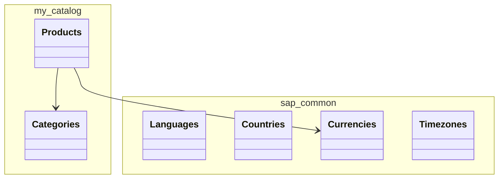

<!-- generated by scripts/gen-registry.mjs | sources: 75b3e3828a9bf7c8 | 2026-09-07 | do not edit -->
# Domain model

Effective model after compilation: entities, elements, types and aspects of the project. The source of truth is `db/*.cds` and `srv/annotations/*.cds`; this is only their reflection. For a targeted lookup use `mcp__cds-mcp__search_model`.

## Diagram

## Entities

### my.catalog.Products

Aspects: cuid, managed. Keys: ID. Projections: CatalogService.Products.

| Element | Type | Title (en) | Annotations |
| --- | --- | --- | --- |
| ID | UUID(36) |  | key |
| createdAt | Timestamp | Created On | @readonly, computed |
| createdBy | String(255) | Created By | @readonly, computed |
| modifiedAt | Timestamp | Changed On | @readonly, computed |
| modifiedBy | String(255) | Changed By | @readonly, computed |
| name | String(100) | Product Name | @mandatory |
| description | String(500) | Description |  |
| price | Decimal(10, 2) | Price | @mandatory, @Measures.ISOCurrency: currency_code, @assert.range: [0,99999999.99] |
| currency | Association to sap.common.Currencies | Currency | @mandatory |
| currency_code | String(3) | Currency | @mandatory |
| stock | Integer | Stock Quantity | @mandatory, @assert.range: [0,1000000] |
| category | Association to my.catalog.Categories | Category | @mandatory, @assert.target: true |
| category_code | String(20) | Category | @mandatory, @assert.target: true |
| imageUrl | String(500) | Image URL |  |

### my.catalog.Categories

Aspects: sap.common.CodeList. Keys: code. Projections: CatalogService.Categories.

| Element | Type | Title (en) | Annotations |
| --- | --- | --- | --- |
| name | String(255) | Name |  |
| descr | String(1000) | Description |  |
| code | String(20) | Category | key |
| texts | Composition of many my.catalog.Categories.texts |  |  |
| localized | Association to my.catalog.Categories.texts |  |  |

### my.catalog.Categories.texts

Aspects: sap.common.TextsAspect. Keys: locale, code. Projections: CatalogService.Categories.texts.

| Element | Type | Title (en) | Annotations |
| --- | --- | --- | --- |
| locale | String(14) | Language Code | key |
| name | String(255) | Name |  |
| descr | String(1000) | Description |  |
| code | String(20) |  | key |

## Project types and aspects

| Name | Kind | Definition |
| --- | --- | --- |
| User | type | String(255) |
| Currency | type | Association to sap.common.Currencies |
| cuid | aspect | ID |
| managed | aspect | createdAt, createdBy, modifiedAt, modifiedBy |

## Reusable aspects from @sap/cds/common

`cuid` (key ID : UUID), `managed` (createdAt, createdBy, modifiedAt, modifiedBy), `temporal`, `Currency`, `Country`, `Language`, `sap.common.CodeList`. Use them, not your own copies.
